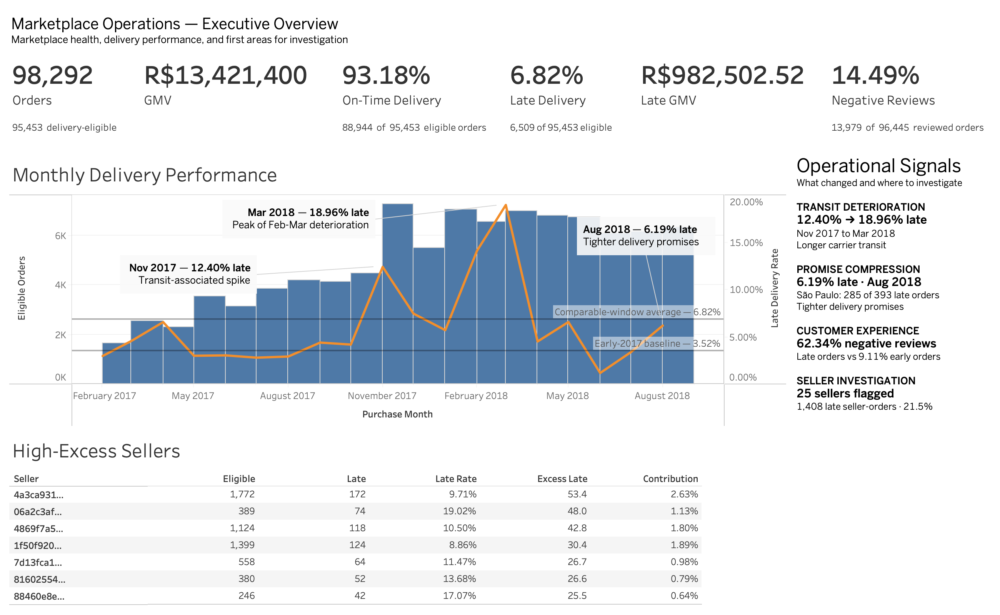
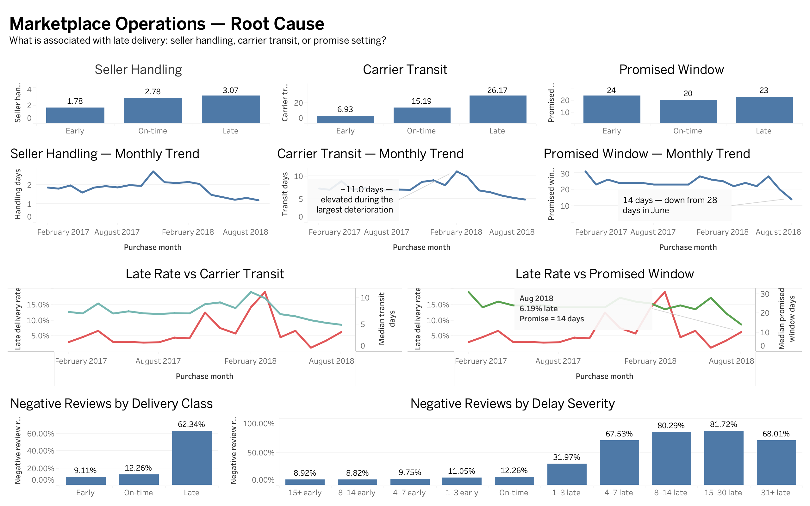
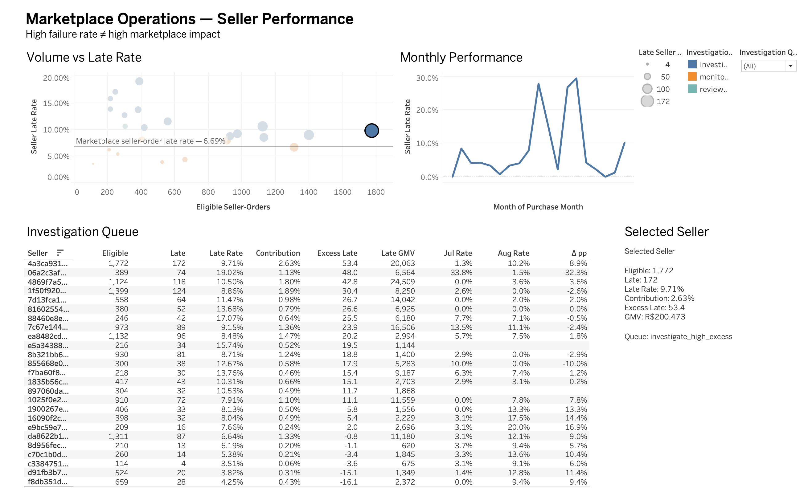

# Marketplace Operations & Customer Experience Intelligence

> **Which operational problems are driving poor marketplace customer experience, and where should Operations intervene first?**

An end-to-end marketplace analytics project using the **Olist Brazilian E-Commerce dataset** to investigate delivery deterioration, seller performance, customer experience, and operational concentration across approximately 100,000 marketplace orders.

The project combines **PostgreSQL, advanced SQL, Python, statistical analysis, automated validation, and Tableau** to move from raw relational data to a decision-oriented operations dashboard.


## Executive Dashboard



The dashboard is designed for marketplace Operations, Seller Success, and leadership teams to answer:

- Is delivery performance deteriorating?
- Is the problem seller handling, carrier transit, or promise setting?
- Where are late deliveries concentrated?
- Which sellers create the greatest marketplace impact?
- How strongly is late delivery associated with customer experience?
- Where should Operations investigate first?


## Executive Summary

The analysis found that the marketplace does **not** have one universal late-delivery problem.

### 1. The largest deterioration was associated with carrier transit

Within the comparable February 2017–August 2018 period:

```text
95,453 delivery-eligible orders
6,509 late orders
6.82% late-delivery rate
R$982,503 late GMV
````

Major deterioration episodes included:

| Period                  | Late / Eligible | Late Rate |
| ----------------------- | --------------: | --------: |
| November 2017           |     904 / 7,288 |    12.40% |
| February 2018           |     926 / 6,555 |    14.13% |
| March 2018              |   1,328 / 7,003 |    18.96% |
| February–March combined |  2,254 / 13,558 |    16.62% |

Carrier transit showed the strongest operational separation:

| Delivery outcome | Median seller handling | Median carrier transit | Median promised window |
| ---------------- | ---------------------: | ---------------------: | ---------------------: |
| Early            |              1.78 days |              6.93 days |                24 days |
| On-time          |              2.78 days |             15.19 days |                20 days |
| Late             |              3.07 days |             26.17 days |                23 days |

Seller handling was also elevated among late deliveries, but the difference was substantially smaller.


### 2. August 2018 showed a different failure mode

August did not look like the earlier transit deterioration.

```text
August late rate: 393 / 6,351 = 6.19%
Median promised window:
June 2018   ≈ 28 days
August 2018 = 14 days
```

Physical fulfillment remained relatively fast while promised delivery windows tightened.

São Paulo accounted for:

```text
285 of 393 August late orders
```

or approximately **72.5%** of the month's late deliveries.

This suggests a different operational problem: **promise compression rather than slower physical fulfillment**.


### 3. Late delivery is strongly associated with worse customer experience

Among reviewed, delivery-performance-eligible orders:

```text
Early delivery:
9.11% negative reviews

Late delivery:
62.34% negative reviews
```

Even relatively short delays matter:

```text
1–3 days late:
31.97% negative reviews
```

The relationship becomes substantially worse as delays increase.

These results are observational associations and are not interpreted as causal treatment effects.


### 4. High seller failure rate is not the same as high marketplace impact

The seller analysis uses **seller-order grain**, where the marketplace contains:

```text
97,811 eligible seller-orders
6,547 late seller-orders
6.69% seller-order late rate
```

A 25-seller investigation queue accounts for:

```text
1,408 late seller-orders
≈21.5% of marketplace late seller-orders
```

Fourteen sellers form the high-excess core.

Example:

```text
Seller: 4a3ca9315b744ce9f8e9374361493884

Eligible seller-orders: 1,772
Late seller-orders:       172
Late rate:               9.71%
Marketplace contribution: 2.63%
Excess late:             +53.4
```

The analysis separates:

> **seller failure rate**

from:

> **seller contribution to marketplace harm**

rather than ranking sellers by rate alone.


## Operational Recommendations

The evidence supports four investigation priorities.

### 1. Investigate carrier transit during high-delay periods

**Owner:** Fulfillment Operations

Focus first on periods and destinations where carrier transit rises materially, especially February–March-like conditions.

Success metrics:

* marketplace late-delivery rate;
* median and p90 carrier transit;
* destination-level late rate;
* late-order volume.


### 2. Review promised delivery windows after compression

**Owner:** Marketplace Operations

When late rates rise while fulfillment remains stable or faster, investigate whether customer promises have become unrealistically tight.

The August 2018 São Paulo pattern is the primary example.

Success metrics:

* promised-window length;
* realized fulfillment time;
* late rate after major promise changes.


### 3. Investigate high-excess sellers before high-rate-only sellers

**Owner:** Seller Success + Fulfillment Operations

Prioritize sellers using:

* volume;
* late seller-orders;
* marketplace contribution;
* excess late;
* recent deterioration.

Avoid escalating very small sellers solely because they have extreme percentage rates.


### 4. Treat delivery reliability as a customer-experience metric

**Owner:** Marketplace Operations

Track negative-review rates alongside delivery performance.

Do not use order-level review outcomes as a seller penalty metric, especially on multi-seller orders.


# Tableau Dashboard

The Tableau workbook is stored at:

```text
dashboard/marketplace_operations.twb
```

The dashboard uses certified extracts generated from the analytical SQL layer rather than redefining business logic inside Tableau.

## Page 1 — Executive Overview


Answers:

* What is marketplace performance?
* Is delivery performance improving or deteriorating?
* How large is the problem?
* Where should Operations look first?

Includes:

* orders;
* GMV;
* on-time delivery rate;
* late-delivery rate;
* late GMV;
* negative-review rate;
* monthly late-rate trend;
* eligible-order volume;
* operational signals;
* high-excess seller preview.


## Page 2 — Root Cause



Separates:

* seller handling;
* carrier transit;
* promised delivery window.

It combines:

* early / on-time / late component comparisons;
* monthly fulfillment-component trends;
* late-rate versus transit context;
* late-rate versus promise context;
* customer-experience outcomes by delivery class;
* negative-review rates by delay severity.

The page intentionally avoids combining the three fulfillment components into a single score.


## Page 3 — Seller Performance



Designed around:

> **High failure rate ≠ high marketplace impact**

Includes:

* eligible seller-order volume versus late rate;
* late-order contribution through point size;
* investigation queue classification;
* 6.69% marketplace seller-order benchmark;
* excess late;
* recent July–August change;
* interactive selected-seller detail;
* monthly seller-performance trend.

Seller selections affect seller-specific detail only and do not alter marketplace Executive KPIs.


## Additional Dashboard Pages

The final workbook will also include:

* **Geography & Product**
* **Monitoring**

These pages will use the same certified dashboard layer and will not introduce new KPI definitions.


# What I Built

This project covers the full analytical workflow:

```text
Olist relational source data
        ↓
PostgreSQL raw layer
        ↓
Data-quality investigation
        ↓
Grain-safe analytical model
        ↓
Certified KPI layer
        ↓
Trend / root-cause / seller / CX analysis
        ↓
Statistical validation
        ↓
Dashboard-ready SQL views
        ↓
Tableau operational dashboard
```

The goal was not simply to create visualizations.

The project explicitly addresses the work that happens **before** a dashboard can be trusted:

* source-table understanding;
* grain definition;
* relationship validation;
* join fan-out prevention;
* missing-data treatment;
* KPI population definitions;
* reconciliation;
* uncertainty;
* operational interpretation.


# Why the Data Model Matters

The Olist dataset is relational and contains several structures that can easily produce incorrect metrics.

Examples:

* orders can contain multiple items;
* orders can involve multiple sellers;
* orders can have multiple payment rows;
* orders can contain multiple review records;
* geolocation contains many rows per ZIP prefix;
* `customer_id` is order-scoped while `customer_unique_id` represents the underlying buyer.

A naive join between order items and payments can multiply financial values.

The project therefore preserves measures at their native grains before aggregating them to a common analytical level.

Important analytical grains include:

| Area                  | Grain                        |
| --------------------- | ---------------------------- |
| Marketplace delivery  | order                        |
| Seller performance    | seller-order                 |
| Product category      | seller-order-category        |
| Customer geography    | order × customer destination |
| Seller monthly detail | seller-order × month         |

This is why:

```text
Late marketplace orders:       6,534
Late marketplace seller-orders: 6,547
```

are both correct.

They represent different units of analysis.


# Data Quality

Raw source data are immutable.

Instead of building one global "clean data" filter, the project uses **metric-specific eligibility rules**.

Examples:

| Metric                   | Usable delivered orders |
| ------------------------ | ----------------------: |
| Delivery performance     |                  96,470 |
| Purchase → delivery time |                  96,470 |
| Seller handling time     |                  95,112 |
| Carrier transit time     |                  96,281 |

Investigated issues include:

* missing delivery timestamps;
* impossible timestamp ordering;
* missing product categories;
* geography gaps;
* review duplication;
* multi-payment orders;
* join fan-out;
* payment versus merchandise-value differences;
* incomplete historical periods.

Quality issues are retained and flagged where possible rather than silently deleting records.

Detailed treatment rules are documented in:

```text
docs/data_quality_report.md
docs/data_model.md
```


# Metric Definitions

Core KPIs are formally defined before visualization.

### Late-delivery rate

```text
Late eligible orders
--------------------
Delivery-performance-eligible orders
```

Eligibility requires a delivered order with valid actual and promised delivery dates.


### On-time delivery rate

```text
Early + exact-date deliveries
-----------------------------
Eligible deliveries
```


### Seller late-delivery contribution

```text
Seller late seller-orders
-------------------------
Marketplace late seller-orders
```

This distinguishes failure rate from marketplace impact.


### Excess late seller-orders

```text
Observed late
-
Eligible × marketplace seller-order late rate
```

The marketplace seller-order benchmark is:

```text
6,547 / 97,811 = 6.69%
```

Excess late is a benchmark residual, not a causal seller effect.


### Negative-review rate

```text
Reviews with score <= 2
-----------------------
Orders with usable reviews
```

Orders without reviews remain visible through review-coverage metrics and are not silently added to the denominator.

The full metric dictionary is documented in:

```text
docs/metric_dictionary.md
```


# Analytical Approach

## SQL

SQL performs the majority of reusable analytical work, including:

* multi-table relational modeling;
* metric-specific eligibility;
* monthly trends;
* rolling 30/90-day performance;
* seller contribution;
* seller excess late;
* rankings and cumulative contribution;
* repeat-customer sequencing;
* geographic segmentation;
* category segmentation;
* fulfillment decomposition;
* customer-experience extracts.

The project also validates major queries and protects against grain-changing joins.


## Python

Python is used for:

* reproducible orchestration;
* quality reporting;
* exploratory analysis;
* visualization;
* bootstrap confidence intervals;
* statistical comparisons;
* regression diagnostics;
* automated tests.

Python does not simply duplicate SQL aggregations.


## Statistical Validation

The main descriptive findings were evaluated using:

* confidence intervals;
* group comparisons;
* bootstrap estimation;
* sensitivity checks;
* an interpretable negative-review logistic model.

Example:

```text
Late vs early negative-review difference:
+53.23 percentage points

95% CI:
52.02 to 54.44 percentage points
```

After adjustment for order value, customer state, repeat purchase, and multi-seller structure, even a 1–3 day delay remained strongly associated with negative reviews.

These models support interpretation but are intentionally kept out of the operational dashboard.


# Validation and Reconciliation

The project treats analytical validation as part of the product.

The dashboard layer is rebuilt with:

```bash
python -m python.scripts.build_dashboard_layer
python -m python.scripts.export_dashboard_extracts
pytest tests/test_dashboard_layer.py -q
```

Current dashboard validation:

```text
8 passed
```

Critical Tableau checks include:

```text
Comparable late rate:
6,509 / 95,453 = 6.82%

Feb–Mar 2018:
2,254 / 13,558 = 16.62%

August 2018:
393 / 6,351 = 6.19%

Selected high-excess seller:
1,772 eligible
172 late
9.71%
+53.4 excess

Watchlist:
25 sellers
14 high-excess
1,408 late seller-orders

Early vs late negative reviews:
9.11% vs 62.34%
```

Dashboard validation is documented in:

```text
docs/dashboard_validation.md
```


# Tech Stack

| Area                | Tools                      |
| ------------------- | -------------------------- |
| Database            | PostgreSQL                 |
| Querying / modeling | SQL                        |
| Analysis            | Python, pandas, NumPy      |
| Statistics          | SciPy, statsmodels         |
| Visualization       | Tableau, matplotlib        |
| Testing             | pytest                     |
| Data source         | Olist Brazilian E-Commerce |
| Version control     | Git, GitHub                |


# Repository Structure

```text
marketplace-operations-analytics/
│
├── dashboard/
│   ├── marketplace_operations.twb
│   └── screenshots/
│       ├── executive_overview.png
│       ├── root_cause.png
│       └── seller_investigation.png
│
├── data/
│   └── README.md
│
├── docs/
│   ├── source_inventory.md
│   ├── relationship_audit.md
│   ├── data_quality_report.md
│   ├── data_model.md
│   ├── metric_dictionary.md
│   ├── root_cause_analysis.md
│   ├── seller_concentration.md
│   ├── customer_experience_analysis.md
│   ├── statistical_validation.md
│   ├── operational_findings.md
│   ├── dashboard_specification.md
│   └── dashboard_validation.md
│
├── outputs/
│   ├── analysis/
│   ├── certification/
│   ├── dashboard/
│   └── figures/
│
├── python/
│   ├── notebooks/
│   └── scripts/
│
├── scripts/
│   └── setup_local_postgres.sh
│
├── sql/
│   ├── raw/
│   ├── quality/
│   ├── staging/
│   ├── analytics/
│   ├── certification/
│   ├── metrics/
│   ├── analysis/
│   ├── kpi_certification/
│   └── dashboard/
│
├── tests/
│
└── README.md
```


# Reproducing the Project

## 1. Install dependencies

```bash
python -m pip install -r requirements.txt
```

## 2. Start PostgreSQL

```bash
./scripts/setup_local_postgres.sh
```

Default local configuration:

```text
host:     127.0.0.1
port:     55432
user:     marketplace
database: marketplace_ops
```

Configuration can be overridden through `.env`.

## 3. Download and load Olist

```bash
python -m python.scripts.download_raw
python -m python.scripts.load_raw
```

## 4. Build and validate the analytical foundation

```bash
python -m python.scripts.run_source_audit
python -m python.scripts.run_quality_investigation
python -m python.scripts.build_analytical_model
python -m python.scripts.run_model_validation
python -m python.scripts.run_certification
```

## 5. Build the KPI and analysis layers

```bash
python -m python.scripts.build_metric_layer
python -m python.scripts.run_metric_layer_validation

python -m python.scripts.build_analysis_layer
python -m python.scripts.run_analysis_validation
```

## 6. Run the analytical workflows

```bash
python -m python.scripts.run_fulfillment_root_cause
python -m python.scripts.run_seller_concentration
python -m python.scripts.run_customer_experience
python -m python.scripts.run_statistical_validation
```

## 7. Build the Tableau-ready layer

```bash
python -m python.scripts.build_dashboard_layer
python -m python.scripts.export_dashboard_extracts
pytest tests/test_dashboard_layer.py -q
```

The generated Tableau-ready extracts are written to:

```text
outputs/dashboard/
```

The Tableau workbook is:

```text
dashboard/marketplace_operations.twb
```


# Key Documentation

| Document                               | Purpose                                      |
| -------------------------------------- | -------------------------------------------- |
| `docs/data_quality_report.md`          | Data-quality findings and treatment rules    |
| `docs/data_model.md`                   | Analytical grains and table design           |
| `docs/metric_dictionary.md`            | KPI definitions and populations              |
| `docs/root_cause_analysis.md`          | Fulfillment decomposition                    |
| `docs/seller_concentration.md`         | Seller contribution and excess-late analysis |
| `docs/customer_experience_analysis.md` | Delivery and review relationship             |
| `docs/statistical_validation.md`       | Confidence intervals and adjusted analysis   |
| `docs/operational_findings.md`         | Findings and intervention framework          |
| `docs/dashboard_specification.md`      | Tableau source and metric specification      |
| `docs/dashboard_validation.md`         | Tableau-to-SQL reconciliation                |


# Limitations

* The analysis is observational and does not estimate causal treatment effects.
* Reviews are missing more often among late orders.
* Reviews occur at order grain and should not be used as seller penalty metrics.
* Seller handling timestamps are order-level and not seller-specific for multi-seller orders.
* No carrier identifier is available.
* Seller first-observed activity is not verified onboarding.
* Excess late is a benchmark residual, not an estimate of seller causality.
* Destination-adjusted seller expectations do not isolate seller behavior.
* The extract ends in August 2018 and has sparse boundary periods.
* August promise compression cannot be validated against a later recovery period.


# Current Status

Completed:

* relational source audit;
* grain and join validation;
* data-quality investigation;
* analytical data model;
* foundation certification;
* formal metric definitions;
* reusable KPI layer;
* advanced SQL analysis;
* KPI reconciliation;
* fulfillment root-cause analysis;
* seller concentration and prioritization;
* customer-experience analysis;
* statistical validation;
* operational intervention framework;
* dashboard-ready SQL layer;
* Tableau Executive Overview;
* Tableau Root Cause page;
* Tableau Seller Performance page;
* dashboard reconciliation and automated tests for completed pages.

Remaining dashboard work:

* Geography & Product;
* Monitoring.

The existing completed dashboard pages are frozen unless a data, metric, interaction, or reconciliation defect is discovered.
