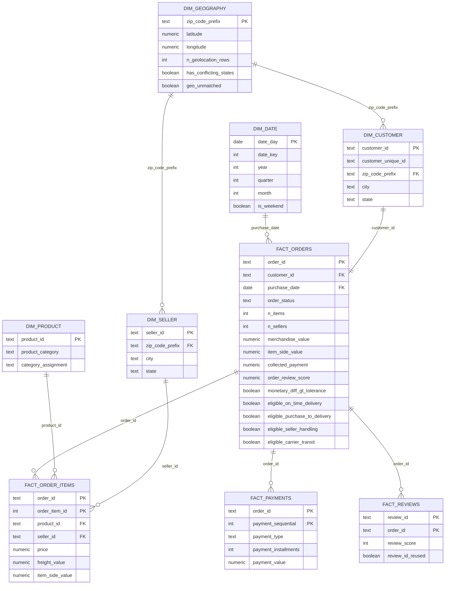

# Analytical Relationship Diagram

This diagram shows the grain-safe analytical model built from the Olist source data.

The model keeps order items, payments, and reviews as separate child facts so their one-to-many relationships do not create fan-out.

## Table grains

| Table | Grain |
|---|---|
| `dim_date` | one calendar date |
| `dim_geography` | one ZIP prefix |
| `dim_customer` | one order-scoped `customer_id` |
| `dim_seller` | one `seller_id` |
| `dim_product` | one `product_id` |
| `fact_orders` | one order |
| `fact_order_items` | one `(order_id, order_item_id)` |
| `fact_payments` | one `(order_id, payment_sequential)` |
| `fact_reviews` | one `(review_id, order_id)` |

## Cardinality notes

- `fact_orders` has one row per order.
- `customer_id` is order-scoped, so each order points to one row in `dim_customer`.
- `customer_unique_id` can repeat across customer-dimension rows and is used for repeat-buyer analysis.
- `fact_order_items`, `fact_payments`, and `fact_reviews` are independent one-to-many children of `fact_orders`.
- `review_id` alone is not unique; the review fact key is `(review_id, order_id)`.
- Geography becomes safe to join only after raw geolocation is collapsed to one row per ZIP prefix.

## Join-safety rule

Do not join `fact_order_items` directly to `fact_payments` and then aggregate monetary values.

Use the native fact for line-level analysis or use the pre-aggregated order-level measures in `fact_orders`.
