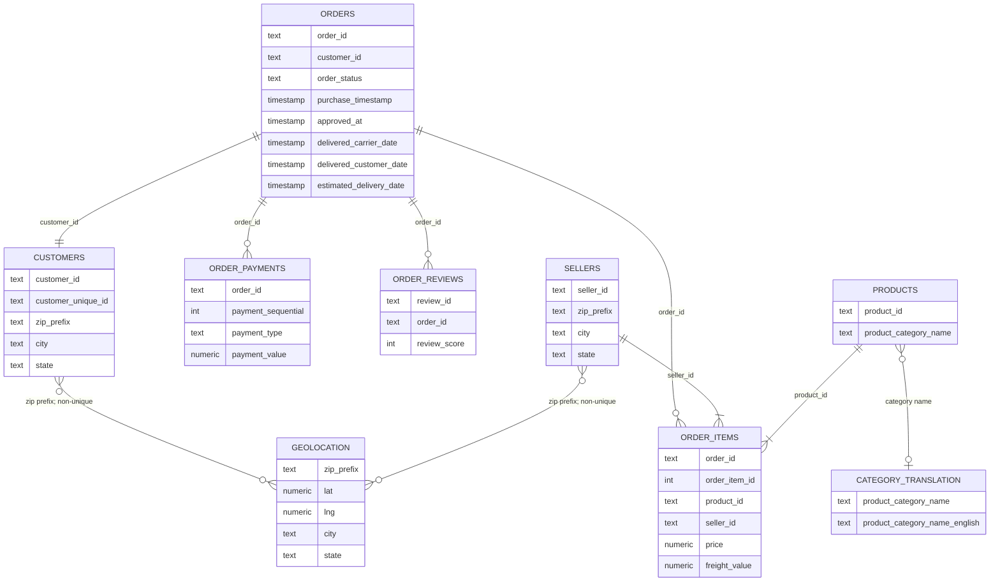

# Source Relationship Diagram

This diagram represents the raw Olist tables after loading into PostgreSQL.

This is a source-level relationship diagram, not the final analytical model.

## Key interpretation

- `orders` is the source hub.
- `order_items`, `order_payments`, and `order_reviews` are separate child grains.
- `order_items` has observed unique key `(order_id, order_item_id)`.
- `order_payments` has observed unique key `(order_id, payment_sequential)`.
- `order_reviews` has observed unique key `(review_id, order_id)`; `review_id` alone is not unique.
- `customer_id` is one-to-one with orders in this extract.
- `customer_unique_id` identifies the underlying buyer and can repeat across orders.
- one order can contain multiple sellers through `order_items`.
- `geolocation` is not unique by ZIP prefix and should not be treated as a direct one-row-per-ZIP dimension.
- category translation is optional because product-side translation coverage is incomplete.

## Join-safety note

`order_items` and `order_payments` should not be joined directly on `order_id` and then aggregated without first controlling their grains. Both are one-to-many children of `orders`, so a naive join can duplicate item and payment measures.

The analytical model is documented in [`docs/analytical_er_diagram.md`](analytical_er_diagram.md) and [`docs/data_model.md`](data_model.md).
